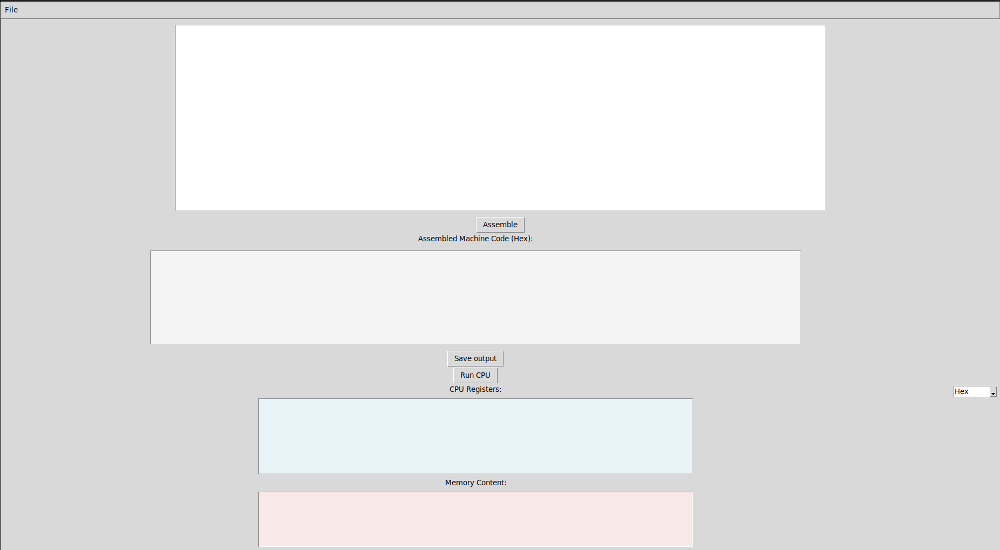
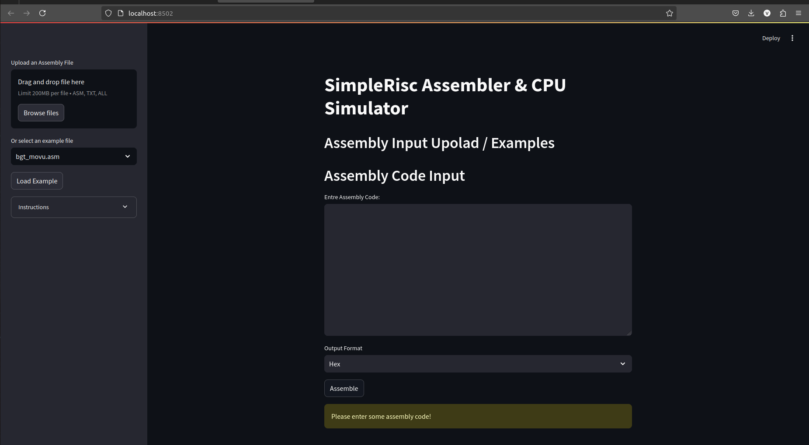
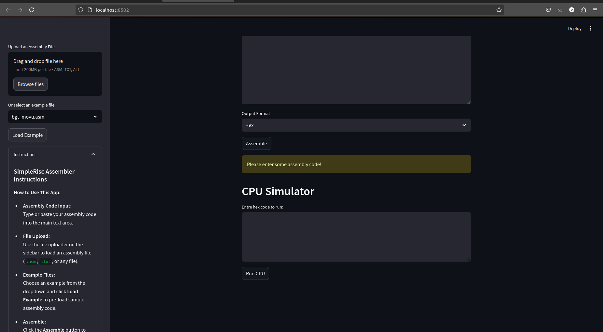

# SimpleRisc Assembler & CPU Simulator

SimpleRisc Assembler & CPU Simulator demonstrates a simplified assembler and CPU simulator for a custom RISC instruction set. The project features:
- A custom assembler that converts assembly code into machine code (in both Hex and Binary formats).
- A CPU simulator that executes the machine code, displaying the register and memory states.
- An interactive web interface built with Streamlit for assembly code entry, file uploads, example selection, assembly, simulation, and code download.

## 📖 Table of Contents
- [Features](#features)
- [Installation](#installation)
- [Usage](#usage)
- [Challenges Faced](#challenges-faced)
- [Screenshots](#screenshots)
- [Future Improvements](#future-improvements)


## Features

- **Assembler:**  
  Converts assembly instructions to 32-bit machine code with support for:
  - Standard arithmetic (`add`, `sub`, `mul`, `div`, `mod`)
  - Logical operations (`and`, `or`, `not`)
  - Shift operations (`lsl`, `lsr`, `asr`)
  - Branching (`beq`, `bgt`, `b`)
  - Memory operations (`ld`, `st`)
  - Subroutine calls (`call`, `ret`)
  - Special MOV instructions with modifiers:  
    - `mov` (default, with sign extension)  
    - `movu` (move unsigned, zero-extended)  
    - `movh` (move high, loading immediate into the high 16 bits)
  - we use '#' for commenting.
  
- **CPU Simulator:**  
  Simulates execution of the machine code on a simple RISC CPU with:
  - 16 registers
  - 256 memory words
  - A program counter and a stack for subroutine calls
  - Flag registers for Zero and Carry conditions

- **Web Interface (Streamlit):**  
  An interactive web application where users can:
  - Type or paste assembly code.
  - Upload assembly files (`.asm`, `.txt`, or any file).
  - Select example files from an `examples` folder.
  - Choose output format (Hex or Binary).
  - Assemble the code, view the assembled machine code, and download it.
  - Run the CPU simulation and view CPU registers and memory content.
  - Read instructions on how to use the app in a sidebar expander.
## Installation
### **Clone the Repository**
```bash
git clone https://github.com/jayinaksha/SimpleRisc.git
cd SimpleRisc
```
### **Install Dependencies**
```bash
pip install -r requirements.txt
streamlit run app.py
```
## Usage
- Enter Assembly Code:
    Manually type or paste assembly code.
    Upload an .asm or .txt file.
    Load a pre-written example from the examples folder.

- Select Output Format:
    Choose Hex or Binary format.

- Assemble the Code:**
    Click Assemble to convert assembly into machine code.
    Download the assembled output using Download Assembled Code.

- Run CPU Simulation:**
    Click Run CPU to execute the machine code.
    Inspect CPU register values and memory state.

- View Instructions:
    Expand the Instructions sidebar for a guide on supported operations.
## Challanges Faced
  During development we encountered these challanges which are resolved now
  - Instruction Encoding:- Handeling various instruction formats such as modifiers 'movu' & 'movh' during encoding.
  - Implementing a two-pass assembler to currectly resolve labels.
  - Implementation of commenting faced issue when the code was running with an operand after # such as mov r2, 4 # mov: something..... It face execution issues which were resolved
  - During CPU simulation calling subroutine functions for call and ret faced challanges but was intresting to resolve
  - During branching operations such as 'bgt' and 'beq' faced problems due to improper 'cmp' command execution. Branching operations were not performed due to issue in execution of compare function and flag registers updates.
  - GUI and Wev Interface:- Though initially developed for running ofline with Tkinter GUI, faced issues in transitioning to web-based interface.
  - Loading Examples Functionality:- Loading written examples feature through the web interface faced initiall issues.
## Screenshorts



    
## Further Improvements
**Step-by-Step Execution:**
Allow users to execute one instruction at a time.
**Memory Visualization:**
Display changes in memory dynamically.
**Debugging Mode:**
Add breakpoints for debugging.
**Syntax Highlighting:**
Improve assembly code editor with syntax highlighting.
